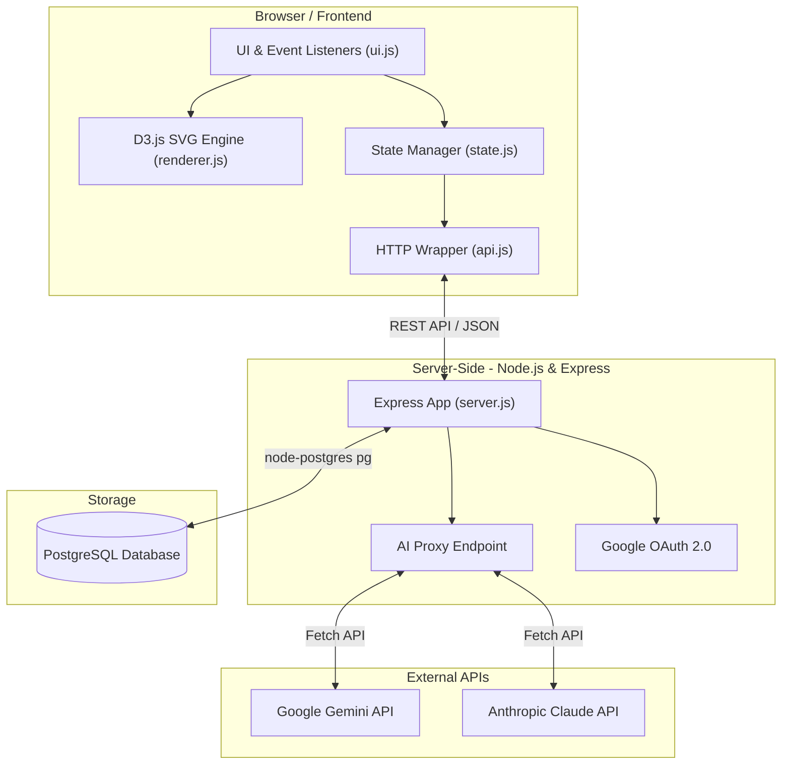
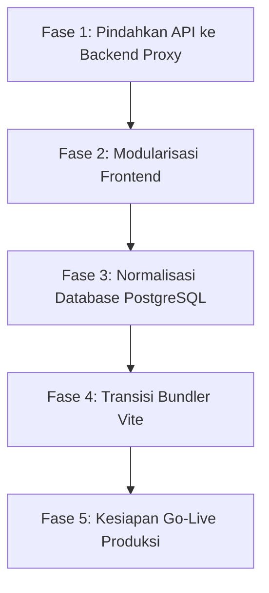

# Engineering Roadmap: Restrukturisasi Codebase 🧠🛠️

Roadmap ini dirancang untuk memecah berkas tunggal frontend yang besar, meningkatkan efisiensi dan keamanan sinkronisasi database PostgreSQL, mengamankan integrasi API, serta mempersiapkan sistem untuk rilis produksi (Go Live).

---

## 🏗️ Arsitektur Sistem Saat Ini

Berikut adalah gambaran arsitektur sistem dari *Rabbit Hole Mindmap Learner*:



### Struktur Folder Utama
```text
├── Dockerfile                  # Multi-stage production container
├── docker-compose.yml          # Postgres & App orchestrator
├── vite.config.js              # Konfigurasi Vite (proxy + host)
├── server.js                   # Entrypoint Backend Express & API
├── index.html                  # Entrypoint Frontend (Vite root)
├── favicon.svg
├── docs/                       # Dokumentasi & Roadmap
└── src/                        # Source Frontend (dikelola Vite)
    ├── index.css               # Sistem Desain CSS Premium
    ├── main.js                 # Entry point Vite (import globals)
    └── js/
        ├── globals.js          # Expose d3, marked, lucide ke window
        ├── state.js            # Global State & LocalStorage
        ├── api.js              # Handler HTTP Request ke server.js
        ├── renderer.js         # Engine render D3.js
        ├── ui.js               # Controller Drawer, Modal, & Chat
        └── trivia.js           # Handler Kuis & Trivia
```

### Skema Database Relasional Saat Ini
Aplikasi menggunakan **PostgreSQL** dengan skema sebagai berikut:
1. **`users`**: Menyimpan profil Google akun yang terintegrasi via OAuth.
2. **`sessions`**: Menyimpan token sesi aktif dengan waktu kedaluwarsa.
3. **`mindmaps`**: Menyimpan data pohon hirarki (`tree_data`), materi penjelasan (`node_cache`), dan kemajuan belajar (`node_statuses`) dalam format teks ter-serialize (JSON string).

---

## 📅 Rencana Fase Restrukturisasi & Rilis



---

## 🟩 FASE 1: Mengamankan API via Backend Proxy (Express Gateway) (SELESAI)
**Tujuan:** Mengamankan API key dan memindahkan pemanggilan kecerdasan buatan dari client-side ke server-side.

- [x] **Setup Environment Variables:**
  - Tambahkan file `.env` di backend untuk menyimpan `ROUTER_API_KEY` secara aman.
  - Pasang dependensi `dotenv` di server.
- [x] **Buat Endpoint Proxy di `server.js`:**
  - Pindahkan fungsi pemanggilan `callRouterAI` dari frontend ke backend Express (`server.js`) sebagai `/api/ai/completions`.
- [x] **Refaktor Frontend `js/api.js`:**
  - Hapus input API key di UI settings (opsional fallback tetap aman).
  - Ubah fungsi panggilan AI di frontend agar melakukan `fetch()` ke endpoint lokal server-side kita.

---

## 🟩 FASE 2: Modularisasi Frontend (SELESAI)
**Tujuan:** Memecah "God File" `app.js` yang memiliki ~1.950 baris menjadi modul-modul kecil yang memiliki tanggung jawab tunggal (*Single Responsibility*).

- [x] **Pecah File Menjadi Struktur Modul Baru:**
  ```text
  js/
  ├── state.js          # Pengelola state global & localstorage persistence
  ├── api.js            # Wrapper komunikasi HTTP ke backend API
  ├── renderer.js       # D3.js engine & visualisasi SVG mindmap
  ├── ui.js             # Event listeners untuk modal, drawer, & chat
  └── main.js           # Entry point utama (inisialisasi aplikasi)
  ```
- [x] **Sesuaikan Pemuatan di `index.html`:**
  - Memuat berkas modular tersebut secara berurutan menggunakan tag `<script>` standar demi menjaga kesederhanaan tanpa overhead bundler di tahap awal.

---

## 🟩 FASE 3: Normalisasi Database & Sinkronisasi Granular (PostgreSQL) (SELESAI)
**Tujuan:** Menghentikan pengiriman payload JSON raksasa secara menyeluruh dan beralih ke penyimpanan relasional yang efisien.

- [x] **Rancang Skema Relasional PostgreSQL Baru:**
  - Buat tabel `mindmaps` (`id`, `name`, `user_id`, `updated_at`).
  - Buat tabel `nodes` (`id`, `mindmap_id`, `parent_id`, `name`, `description`, `explanation`, `status`, `depth`).
- [x] **Buat REST API Granular Baru di `server.js`:**
  - `GET /api/mindmaps` — Mengambil semua daftar topik mindmap (seperti saat ini).
  - `GET /api/mindmap/:id` — Mengambil mindmap beserta relasi node-nodenya (dibangun kembali menjadi objek pohon di backend/frontend).
  - `POST /api/node` — Menambahkan satu node kustom baru.
  - `PATCH /api/node/:id/status` — Mengupdate status belajar satu node secara instan.
  - `DELETE /api/node/:id` — Menghapus cabang node tertentu secara rekursif di PostgreSQL.
- [x] **Implementasi Lazy-Loading Materi:**
  - Jangan kirim kolom `explanation` yang sangat besar di awal pemuatan pohon D3.
  - Panggil API `GET /api/node/:id/explanation` hanya ketika pengguna mengeklik kartu node tertentu untuk membuka detail drawer.

---

## 🟩 FASE 4: Transisi ke Tooling Modern & Bundler (Vite) (SELESAI)
**Tujuan:** Memastikan keandalan aplikasi jangka panjang tanpa bergantung sepenuhnya pada link CDN eksternal.

- [x] **Inisialisasi Project Bundler:**
  - Integrasi **Vite** ke workflow pengembangan (`vite.config.js` dengan proxy ke Express port 4000).
  - Pindahkan file frontend statis ke folder `src/` (termasuk `index.css`, `main.js`, dan seluruh `js/`).
  - Konfigurasi `host: true` agar Vite Dev Server bisa diakses dari device lain di jaringan lokal.
- [x] **Gunakan Local npm Packages:**
  - Instal `d3`, `marked`, dan `lucide` via npm (devDep `vite`).
  - Buat `src/js/globals.js` yang mengekspos library ke `window` agar kompatibel dengan kode lama tanpa refactor besar.
  - Bersihkan seluruh tag `<script>` CDN dari `index.html`.
- [x] **Update Dockerfile:**
  - Dockerfile multi-stage: stage builder menjalankan `npm run build` (Vite), stage runner hanya menyalin `dist/` — tanpa source code di container produksi.

---

## 🔵 FASE 5: Kesiapan Go-Live Produksi (Production Readiness) (DIUSULKAN)
**Tujuan:** Mengamankan, mengoptimalkan, dan mempersiapkan aplikasi Express-PostgreSQL agar andal dan aman saat di-deploy ke produksi (VPS, Render, Railway, Fly.io, dsb.).

- [ ] **Security Hardening (Pengamanan Tambahan):**
  - Pasang middleware `cors` untuk membatasi domain asal yang boleh berinteraksi dengan API backend.
  - Pasang middleware `helmet` guna menyematkan HTTP security headers untuk mencegah celah keamanan umum.
  - Terapkan `express-rate-limit` pada endpoint proxy AI `/api/ai/completions` untuk menghindari eksploitasi kuota API Key.
- [ ] **Optimasi Performa & Kestabilan Database:**
  - Buat indexing PostgreSQL yang tepat pada kolom yang sering dicari seperti `user_id` di tabel `mindmaps` dan `sessions` untuk mempercepat query.
  - Tambahkan middleware `compression` (gzip) di Express untuk mempercepat loading aset statis (HTML, CSS, JS modular) ke browser klien.
- [ ] **Monitoring & Health Checks:**
  - Tambahkan endpoint `/health` sederhana untuk pemeriksaan status server oleh orchestrator cloud (uptime monitoring) dan status koneksi pool PostgreSQL.
  - Integrasikan access logging minimalis seperti `morgan` untuk mencatat log traffic secara rapi ke standard output.
- [ ] **Pipeline Deployment & Containerization:**
  - [x] Rancang berkas `Dockerfile` dan `docker-compose.yml` multi-stage minimalis untuk containerization yang ringan dan portabel.
  - [x] Strategi rollback via Git tags (`git checkout <tag> && docker compose up -d --build`).
  - [ ] Konfigurasikan start production script di `package.json` menggunakan process manager seperti `pm2` untuk otomatis mendeteksi crash dan me-restart server.
